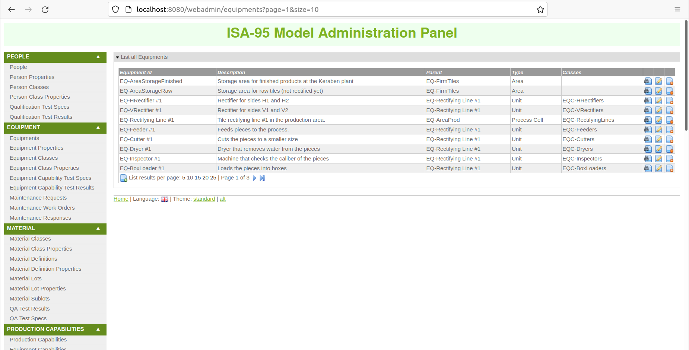
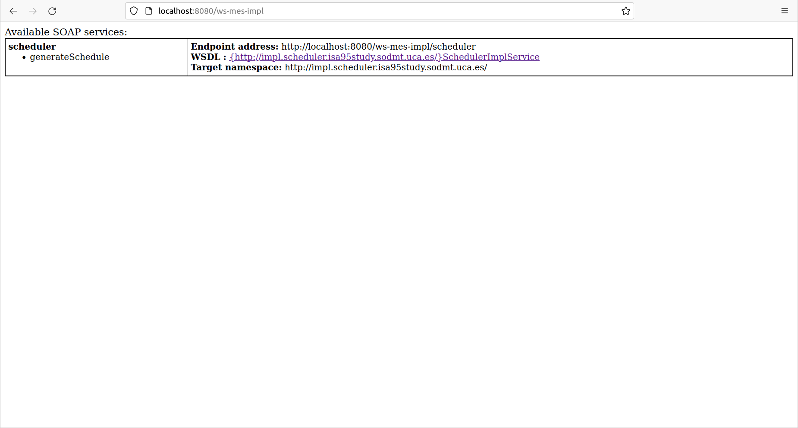

# Sample webapp

This is a sample application used to test drive the automated Java-based and WSDL-based performance test case generation in SODM+T.

## Structure

The application is a [Spring Roo](https://projects.spring.io/spring-roo/) webapp, composed of four modules:

* [`persistence`](persistence) is a [Hibernate](https://hibernate.org/)-based set of database entities to represent a manufacturing enterprise.
* [`webadmin`](webadmin) is a web-based interface for CRUD over these database entities.
* [`ws-mes-api`](ws-mes-api) contains the WSDL of the scheduling web service that will be exposed from the app.
* [`ws-mes-impl`](ws-mes-impl) contains the [Apache CXF](https://cxf.apache.org/)-based implementation of the web service.

## Building and testing

To build and test this application, simply run Maven:

```shell
mvn clean install
```

## Running the webapp

To run this application, install [Docker](https://docs.docker.com/engine/install/) and [Docker Compose](https://docs.docker.com/compose/install/), and then run this command from this directory:

```shell
docker-compose up
```

Note that there is a bit of a race condition between the database being set up and the web application starting.
If the web application fails to run because it tries to start before the database is ready, wait for the database to fully start, then stop Docker Compose with Ctrl+C and start it again with the above command.

Once the webapp is fully up, you will have access to its two servlets.

### /webadmin: Roo-based entity CRUD



From [http://localhost:8080/webadmin/](http://localhost:8080/webadmin/), you can access a webapp for basic CRUD (Create, Read, Update, Delete) management of the data entities of a simulated manufacturing enterprise.

### /ws-mes-impl: WSDL-enabled web service



From [http://localhost:8080/ws-mes-impl/](http://localhost:8080/ws-mes-impl/), you can access a CXF-based web service for generating manufacturing schedules, together with its WSDL-based definition.

You can use SODM+T to extract a message catalog model from its WSDL definition, weave it with a performance requirement derived from a model of the composition(s) it'd be part of, and generate performance test cases using The Grinder.
For more details, please check the [project website](https://agarciadom.github.io/sodmt/).